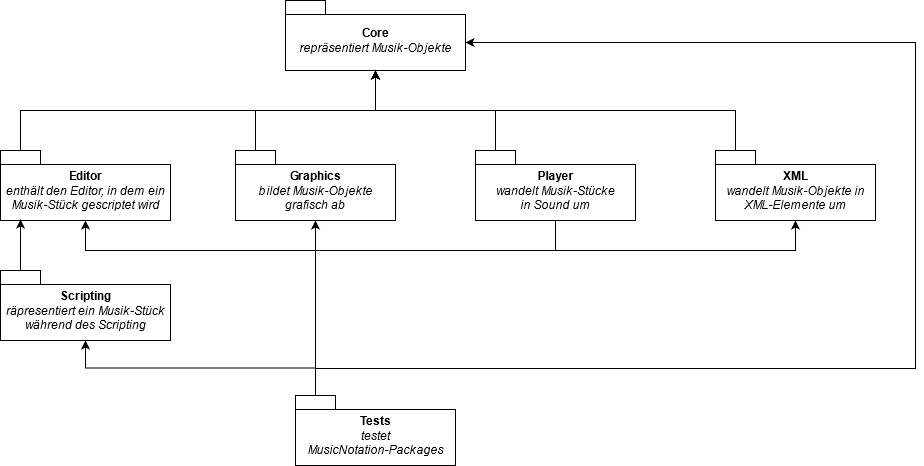

# Architectural Information

> This is a logical overview of our overall structure and not an exact representation of our class hierarchy.

## Packages Overview

## Classes Overview
Here you can see the most important classes and their dependencies. 
  
When a script is written in the editor and you click `CTRL+S`, the `MNEditor` first updates its `MNEditorContent`. It is a representation of the text, you put into the editor. Then the `MNEditor` creates a `MNEditorEnvironment`, in which the content will be evaluated and then the `MNEditorStatus` will be updated accordingly (it will show syntax errors for example). If the status is `ok`, the script will be executed as a method on a `MNContext` instance. The `MNContext` creates a `MNProject` which will be filled with `MNMusicObjects` as defined in the script. The music objects are structured hierarchically. A `MNProject` has many `MNParts` (which are the lines). A `MNPart` has many `MNMeasures`. A `MNMeasure` has many `MNNotes`. They are connected through a parent-child relationship.
Every subclass of `MNMusicObject` has a subclass of `MNMorph`, which represents the music object graphically. When you then click the `open preview` button, those morphs, that belong to the music objects in the project of the context of the editor, are drawn in a `MNPreviewMorph`.

## Structure Overview

## Music Objects 

## Morphs

