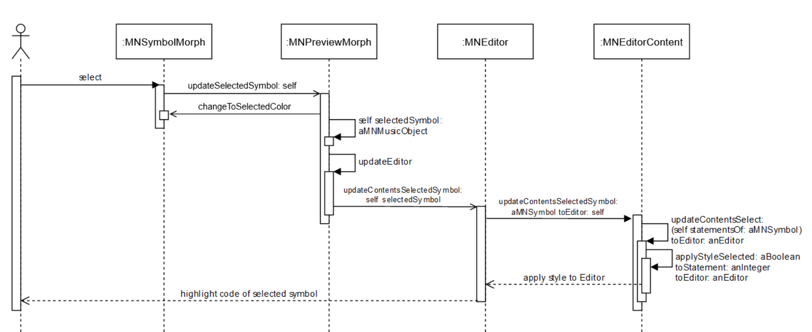

# Entry Points

Interesting first steps are marked as issues in the Github repository with the label [proposal](https://github.com/hpi-swa-teaching/MusicNotation/labels/proposal).

To familiarize yourself with the code, the following sections are useful (preferably in this order):
- Internal repesentation of music: 
  - Core package -> MNMusicObject with all subclasses
- Working with music: 
  - Core package -> MNMusicVisitor with all subclasses, MNTansposer with all subclasses
- Graphical representation of music: 
  - Graphics package -> MNMorph with all subclasses, MNFont with all subclasses, MNGlyph and MNPathDrawer with all subclasses
- Editor window:
  - Editor package -> MNEditor, MNPluggableCustomSpec in conjunction with ToolBuilder
- Scripting: 
  - complete Scripting package 
  - Editor package -> MNEditorEnvironment
- Music playback: 
  - Core package -> MNMusicVisitor with all subclasses 
  - complete Player package
- MusicXML support: 
  - Core package -> MNMusicVisitor with all subclasses 
  - complete XML package

If you are wondering, how the highlighting of code in the editor works after clicking on a symbol in the preview, this sequence diagram may help you to understand:

The `MNEditorContent` maintains a list of statements (the `contentsList`), which is the content of the editor split at dots (with extra rules applied for paranthesises) - the `MNEditorContentSplitter` does the work here. Whenever a script is evaluated, the `MNEditorContent` also updates another list (the `statementMapping`) which maps every created Symbol to the right statement. 
The `MNPreviewMorph` saves the currently selected symbol. As soon as you click on a `MNSymbolMorph`, it is updated and the color of the new selected symbol is changed. Then the `MNEditorContent` is given the selected symbol. It looks it up in the `statementMapping` and updates its style by highlighting the associated statement. 

This functionality can still be improved. Have a look at issue #103 for instance.
