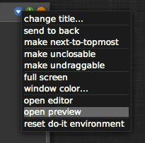
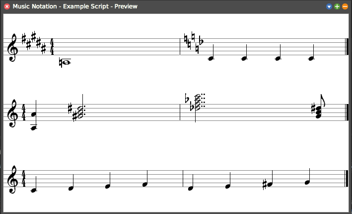

# Using the Music Scripting Window

You can open the Music Scripting Window by running `MNEditor open.` in your Workspace.

To open the corresponding Preview Window click on `open preview` in the scripting window's options menu.



Whenever the script is saved, it is run automatically and the preview window is updated.

The basic syntax for adding notes in a script is *name of pitch* / *duration* where *name of pitch* consists of the step, octave and optionally the alter (e.g. `c3f`, `g4`, `a5s`) and *duration* is the inverse of the note's duration. This should be a power of 2 and can be modified by the dot method. Notes can be repeated using the * operator (e.g. `c4 / 8 * 4`). The alter can also be set via the messages `f`, `n` and `s`.

Rests can be created in a similar fashion by using `r` instead of the name of a pitch (e.g. `r / 4`).

To create chords you can either put them together manually by combining pitches with the + operator (e.g. `c4 + e4 + g4`) or by using chord messages (e.g.`c maj`).

Each measure can have a key which can be set with the `keyFifths:` message using the circle of fifths. Alternatively, `keyCustom:` or `key:` can be used to set a custom key manually. If the key of a measure is not set then it will use the key of the previous measure. By default, the time signature is set to 4/4 but can be changed with the message `timeNumerator:denominator:` (e.g. `self measure timeNumerator: 5 denominator: 4.`).

To add a new part, put in the following code:
```smalltalk
self project addPart: (MNPart new addMeasure: MNMeasure new).
```
All following notes will be added in the new part.

Notes, measures, parts and projects can be transposed using the `transpose:`, `transposeFlat:` and `transposeSharp:` messages.

The resulting music can be played by adding the line `project asSound play.` (Note: This will result in the project playing whenever it is saved) and converted into MusicXML with `project asXMLString` or `project asXMLElement` or  directly saved with `project writeXMLWithFileChooser`.

```smalltalk
"Example Script"
| notes1 |

a3  / 1.
self measure keyFifths: 5.
c4 / 4 * 4.
self measure keyCustom: {$d -> -1}.

project addPart: (MNPart new addMeasure: MNMeasure new).  
a4 + a3 / 4.  
g4 s min / 2 dot.  
d5 f maj7 / 2 dot dot.  
g4 aug / 8.  

project addPart: (MNPart new addMeasure: MNMeasure new).
notes1 := {c4 . d4 . e4 . f4}.
2 timesRepeat: [ notes1 / 4 ].
self measure transposeSharp: 2.
```

